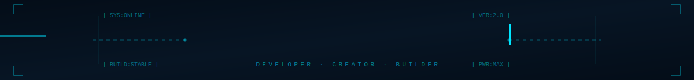

  

#  Hi there! I'm Omkar Sawant

 

&nbsp;

&nbsp;

---

##  About Me

I'm currently a student at **Finolex Academy of Management and Technology (FAMT), Ratnagiri**, passionate about building intelligent, efficient, and day-to-day problem solutions.

- 💻 Skilled in **C** | **C++** and **Python**
- 🧠 **NLP**, **ML** & **DL** Enthusiast — Exploring Emerging AI Tools & Industry Trends — Hands-On with ***Google AI Studio*** & ***Google Labs***
- 🛠️ I love building tools that solve real-world problems
- 💬 I enjoy explaining concepts in simple ways and collaborating on tech projects
- 🌱 Exploring **LLM-powered applications**
- 🧩 No-Code Tools on Prebuilt Stack on ***n8n***

 

---

##  Tech Stack

### Languages

### AI / ML & Data

  
  
  
  
  
  

### Backend & APIs

  
  
  

### Databases

  
  

### Automation

  

### Web & UI

  
  
  
  

---

## ⭐ Top Repositories

| # | Repository | Stars | Description |
|---|-----------|-------|-------------|
| 1 | [**Multi-Agent-AI-Workflow-for-Content-Creation**](https://github.com/OMI-KALIX/Multi-Agent-AI-Workflow-for-Content-Creation) | ⭐ 3 | A fully automated multi-agent AI system that creates LinkedIn content end to end. Specialized AI agents handle research, writing, formatting, and image creation—reducing hours of work to minutes while maintaining quality and consistency. |
| 2 | [**ThinkLessX-Telegram-AI-Decision-Bot**](https://github.com/OMI-KALIX/ThinkLessX-Telegram-AI-Decision-Bot) | ⭐ 1 | ThinkLessX is an intent-aware Telegram AI bot designed to eliminate decision debt. Instead of overwhelming users with summaries or suggestions, it converts incoming messages, documents, and media into clear next actions. |
| 3 | [**Skill-Bridge-AI-Resume-Analysis-Learning-Guidance-Bot**](https://github.com/OMI-KALIX/Skill-Bridge-AI-Resume-Analysis-Learning-Guidance-Bot) | ⭐ 2 | SkillBridge is an AI-powered resume analysis and learning guidance bot that helps job seekers understand why their resume fails ATS screening and what to fix or learn next, without guessing. It focuses on clarity over hype: What you have → What's missing → What to improve → What to learn next |
| 4 | [**MindFlow-Visual-Tutor**](https://github.com/OMI-KALIX/MindFlow-Visual-Tutor) | ⭐ 2 | MindFlow Visual Tutor is an AI-powered visual learning and Q&A bot that helps learners understand complex YouTube lectures by converting them into structured learning flows, visual diagrams, and interactive explanations. |
| 5 | [**Selenium1**](https://github.com/OMI-KALIX/Selenium1) | ⭐ 0 | — |

---

##  Featured Projects

&nbsp;

  

&nbsp;

###  Project Highlights

> 🔍 **GeoAlert** – Location-based safety system
>
> 🎥 **Video Downloader** – A GUI-based YouTube/media downloader
>
> 🤖 **CollegeBot** – Smart assistant for campus FAQs powered by LLMs
>
> 🤖 **AI Maths Teacher** – Automated step-by-step maths solver powered by AI & n8n

>  Check them out in the pinned repositories 👇

---

##  GitHub Analytics

&nbsp;

  

---

##  GitHub Achievements

---

## Contribution Graph

  <picture>
    <source media="(prefers-color-scheme: dark)" srcset="https://raw.githubusercontent.com/Platane/snk/output/github-contribution-grid-snake-dark.svg">
    <source media="(prefers-color-scheme: light)" srcset="https://raw.githubusercontent.com/Platane/snk/output/github-contribution-grid-snake.svg">
    
  </picture>

---

##  Open to Opportunities

| 🚀 Internship Positions | 🧠 Open-Source Collaborations | 🔬 Research Opportunities | 💡 Innovative Startup Projects |
|:-:|:-:|:-:|:-:|
| AI / ML focused roles | Join forces on impactful projects | Academic & industry research | Early-stage ventures |

 

*💬 Let's connect if you're working on something exciting!*

---

##  Contact Me

&nbsp;

---

###  Quote of the Day

---

##  If you like my work, please ⭐ STAR the repos & follow me 🫡😁🤗

