  

#  Hi there! I'm Omkar Sawant

---

  
  
  

---

##  About Me

I'm currently a student at **Finolex Academy of Management and Technology (FAMT), Ratnagiri**, passionate about building intelligent, efficient, and day-to-day problem solutions.

- 💻 Skilled in **C** | **C++** and **Python**
- 🧠 **NLP**, **ML** & **DL** Enthusiast | Exploring Emerging AI Tools & Industry Trends | Hands-On with ***Google AI Studio*** & ***Google Labs***
- 🛠️ I love building tools that solve real-world problems
- 💬 I enjoy explaining concepts in simple ways and collaborating on tech projects
- 🌱 exploring **LLM-powered applications**
- 🧩  No-Code Tools on Prebuilt Stack on ***n8n***

---

##  Tech Stack

### **Languages**

### **Tools & Frameworks**

  
  
  
  
  

### **Web & UI**

  
  
  
  

##   Open to Opportunities

  

    🚀 <b>Internship Positions</b> in <b>AI / ML</b> 
    🧠 <b>Open-Source Project Collaborations</b> 
    🔬 <b>Research Opportunities</b> 
    💡 <b>Innovative Startup Projects</b> 
    🎯 <b>Mentorship in Advanced Topics</b>
  

 

  

  

    💬 Let’s connect if you’re working on something exciting!
  

---

##  Featured Projects

  
  

  

  

###  Project Highlights

- 🔍 **GeoAlert** – Location-based safety system  
- 🎥 **Video Downloader** – A GUI-based YouTube/media downloader  
- 🤖 **CollegeBot** – Smart assistant for campus FAQs powered by LLMs  

>  Check them out in the pinned repositories 👇

---

##  GitHub Analytics

  
  

---

##  GitHub Achievements

  

  <picture>
    <source media="(prefers-color-scheme: dark)" srcset="https://raw.githubusercontent.com/Platane/snk/output/github-contribution-grid-snake.svg">
    <source media="(prefers-color-scheme: light)" srcset="https://raw.githubusercontent.com/Platane/snk/output/github-contribution-grid-snake.svg">
    
  </picture>

---

##  Contact Me

  
  

---

###  Quote of the Day

---

> ##  If You Like OUR REPO, please STAR it & follow me 🫡😁🤗

